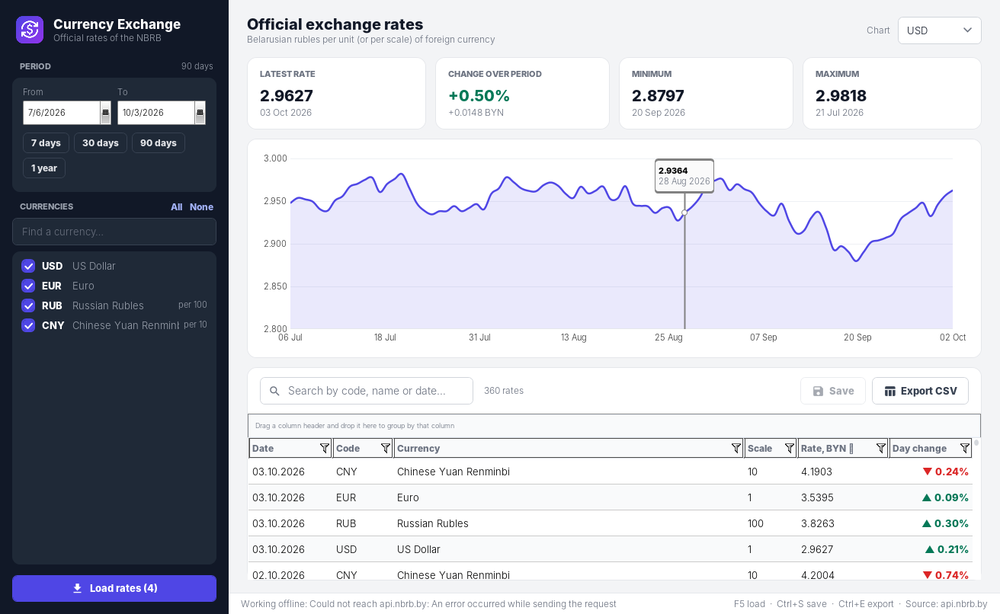
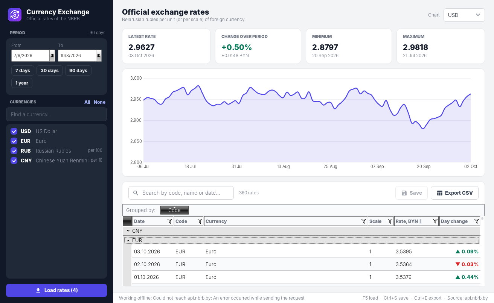
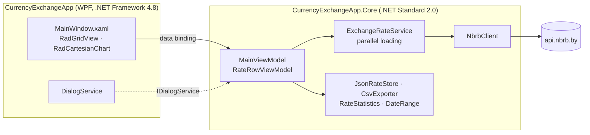

<div align="center">


# Currency Exchange

**A WPF desktop app for official exchange rates of the National Bank of the Republic of Belarus, with charts, editing and CSV export.**

[](https://github.com/Staery/CurrencyExchangeApp/actions/workflows/ci.yml)


[](LICENSE)

**English** · [Русский](README.ru.md)

</div>

---

Currency Exchange downloads the history of official exchange rates from the
[public API of the National Bank of the Republic of Belarus](https://www.nbrb.by/apihelp/exrates) for the currencies
and period you choose. It shows the rates in a **Telerik RadGridView** (grouping, filtering, inline editing) and in an
interactive **RadCartesianChart**, and keeps the data on disk so the app works offline.

## 📸 Screenshots



*RadGridView grouped by currency code (drag a column header to the group panel):*



<sub>The screenshots show demo data.</sub>

## ✨ Features

| | |
|---|---|
| 🌐 **Live data from the NBRB** | Daily official rates via `api.nbrb.by`. Periods longer than a year are split into the one-year requests the API allows |
| ⚡ **Parallel, cancellable loading** | Up to four currencies are loaded at a time, with a progress bar and a *Cancel* button |
| 📈 **Interactive chart** | Rate history with a trackball, plus the latest rate, the change over the period, and the minimum and maximum with their dates |
| 🗂 **Powerful grid** | Telerik RadGridView with group-by-column, filters, sorting, multi-select and day-over-day change shown as ▲/▼ |
| ✏️ **Corrections** | Rates can be edited in place. Edited rows are highlighted and saved with *Save* (`Ctrl+S`); invalid values are rejected |
| 💾 **Works offline** | The last loaded data is restored on start-up. If the API is unreachable, the currency list is built from the saved data |
| 📤 **CSV export** | Exports the visible rows (`Ctrl+E`) in an Excel-friendly format (UTF-8 with BOM, `;`-separated) |
| 🔍 **Quick search** | Filters currencies in the picker and rows in the grid by code, name or date |

## 🧱 Tech stack

| Area | Technology |
|---|---|
| UI | WPF on .NET Framework 4.8, [Telerik UI for WPF](https://www.telerik.com/products/wpf/overview.aspx) R1 2022 (RadGridView, RadCartesianChart, RadDatePicker), a custom theme and vector icons |
| Core | .NET Standard 2.0 library: MVVM with [CommunityToolkit.Mvvm](https://learn.microsoft.com/dotnet/communitytoolkit/mvvm/), `HttpClient` + `System.Text.Json`, `TimeProvider` |
| Tests | xUnit on .NET 8, 33 tests. The HTTP layer is tested against a stub `HttpMessageHandler` |
| CI/CD | GitHub Actions: build, test, publish the app as an artifact, and create a GitHub release for `v*` tags |

## 🏗 Architecture



- **The UI framework is isolated.** All the logic lives in a .NET Standard library. The WPF app on .NET Framework (which
  the Telerik assemblies require) and the .NET 8 test project both reference it.
- **Typed, defensive HTTP client.** `NbrbClient` turns HTTP errors, timeouts and malformed JSON into a single
  `ExchangeRateApiException` with a readable message, and splits long periods into one-year requests.
- **Throttled concurrency.** `ExchangeRateService` uses a `SemaphoreSlim` to limit parallel requests and reports
  progress through `IProgress<int>`.
- **Testable time and I/O.** `TimeProvider`, `IRateStore` and `IDialogService` are injected, so view-model scenarios
  (loading, cancellation, offline start, editing, export) run in unit tests.

### Project layout

```
CurrencyExchangeApp/
├── lib/RCWPF/2022.1.222.45/      # Telerik UI for WPF assemblies used by the app
├── src/
│   ├── CurrencyExchangeApp/      # WPF application (.NET Framework 4.8)
│   └── CurrencyExchangeApp.Core/ # Models, NBRB client, services, view models (.NET Standard 2.0)
├── tests/CurrencyExchangeApp.Core.Tests/
└── .github/workflows/ci.yml
```

## 🛠 Improvements over the first version

- Telerik references point to `lib/` in the repository instead of `C:\Program Files (x86)\Progress\...`, and only the
  six assemblies the app uses are kept (21 MB instead of 155 MB).
- Loading is parallel and cancellable instead of one request at a time, and periods longer than a year are supported.
- The currency **scale** is taken into account (for example, RUB is quoted per 100 units).
- Requests are built correctly. Previously, a date parameter produced `rates??ondate=`.
- Errors are reported once, with a clear message, instead of being wrapped three times.
- Data is stored in `%APPDATA%\CurrencyExchangeApp\rates.json` and written atomically, instead of `data.json` in the
  working directory being rewritten after every cell change.
- The view model no longer calls `MessageBox` directly, so it can be unit-tested.

## 🚀 Getting started

Requirements: Windows with .NET Framework 4.8 and the [.NET 8 SDK](https://dotnet.microsoft.com/download/dotnet/8.0)
(or Visual Studio 2022 with the *.NET desktop development* workload).

```bash
git clone https://github.com/Staery/CurrencyExchangeApp.git
cd CurrencyExchangeApp
dotnet run --project src/CurrencyExchangeApp
```

```bash
dotnet test tests/CurrencyExchangeApp.Core.Tests   # runs on any OS
```

| Shortcut | Action |
|---|---|
| `F5` | Load rates |
| `Ctrl+S` | Save edited rates |
| `Ctrl+E` | Export to CSV |

> The assemblies in `lib/` are a Telerik UI for WPF trial build, so Telerik may show a trial notice when the app runs.

## 📄 License

The source code is under the [MIT](LICENSE) license © 2024–2026 Anton Selkin. Telerik UI for WPF is a commercial
product of Progress Software and is covered by its own license.
