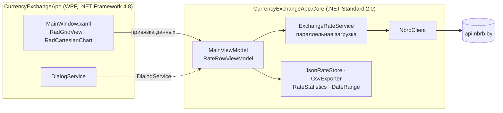

<div align="center">


# Currency Exchange

**Настольное WPF-приложение для официальных курсов валют Национального банка Республики Беларусь: графики, редактирование и экспорт в CSV.**

[](https://github.com/Staery/CurrencyExchangeApp/actions/workflows/ci.yml)


[](LICENSE)

[English](README.md) · **Русский**

</div>

---

Currency Exchange загружает историю официальных курсов из
[открытого API Национального банка Республики Беларусь](https://www.nbrb.by/apihelp/exrates) для выбранных валют
и периода. Курсы отображаются в **Telerik RadGridView** (группировка, фильтры, редактирование в ячейке) и на
интерактивном графике **RadCartesianChart**. Данные сохраняются на диск, поэтому приложение работает и без сети.

<!-- screenshots -->

## ✨ Возможности

| | |
|---|---|
| 🌐 **Актуальные данные НБРБ** | Ежедневные официальные курсы через `api.nbrb.by`. Периоды длиннее года разбиваются на запросы не длиннее года, как требует API |
| ⚡ **Параллельная загрузка с отменой** | До четырёх валют одновременно, индикатор прогресса и кнопка *Cancel* |
| 📈 **Интерактивный график** | История курса с трекболом, а также последний курс, изменение за период и минимум и максимум с датами |
| 🗂 **Мощная таблица** | Telerik RadGridView: группировка по колонкам, фильтры, сортировка, множественный выбор, изменение к предыдущему дню (▲/▼) |
| ✏️ **Корректировки** | Курс можно изменить прямо в ячейке. Изменённые строки подсвечиваются и сохраняются кнопкой *Save* (`Ctrl+S`), некорректные значения отклоняются |
| 💾 **Работа без сети** | При запуске восстанавливаются последние загруженные данные. Если API недоступен, список валют строится по сохранённым данным |
| 📤 **Экспорт в CSV** | Видимые строки выгружаются в CSV (`Ctrl+E`), который корректно открывается в Excel (UTF-8 с BOM, разделитель `;`) |
| 🔍 **Быстрый поиск** | Фильтрует валюты в списке и строки таблицы по коду, названию или дате |

## 🧱 Технологии

| Область | Технологии |
|---|---|
| Интерфейс | WPF на .NET Framework 4.8, [Telerik UI for WPF](https://www.telerik.com/products/wpf/overview.aspx) R1 2022 (RadGridView, RadCartesianChart, RadDatePicker), собственная тема и векторные иконки |
| Ядро | Библиотека .NET Standard 2.0: MVVM на [CommunityToolkit.Mvvm](https://learn.microsoft.com/dotnet/communitytoolkit/mvvm/), `HttpClient` + `System.Text.Json`, `TimeProvider` |
| Тесты | xUnit на .NET 8, 33 теста. HTTP-слой проверяется через подменённый `HttpMessageHandler` |
| CI/CD | GitHub Actions: сборка, тесты, публикация приложения как артефакта и релиз на GitHub для тегов `v*` |

## 🏗 Архитектура



- **Логика отделена от UI-фреймворка.** Вся логика находится в библиотеке .NET Standard. На неё ссылаются и
  WPF-приложение на .NET Framework (этого требуют сборки Telerik), и тесты на .NET 8.
- **Типизированный и надёжный HTTP-клиент.** `NbrbClient` превращает ошибки HTTP, таймауты и некорректный JSON в одно
  исключение `ExchangeRateApiException` с понятным сообщением и разбивает длинные периоды на запросы не длиннее года.
- **Ограниченный параллелизм.** `ExchangeRateService` ограничивает число одновременных запросов через `SemaphoreSlim`
  и сообщает о прогрессе через `IProgress<int>`.
- **Время и ввод-вывод подменяются в тестах.** `TimeProvider`, `IRateStore` и `IDialogService` внедряются через
  конструктор, поэтому сценарии ViewModel (загрузка, отмена, запуск без сети, редактирование, экспорт) проверяются
  модульными тестами.

### Структура проекта

```
CurrencyExchangeApp/
├── lib/RCWPF/2022.1.222.45/      # Используемые сборки Telerik UI for WPF
├── src/
│   ├── CurrencyExchangeApp/      # WPF-приложение (.NET Framework 4.8)
│   └── CurrencyExchangeApp.Core/ # Модели, клиент НБРБ, сервисы, ViewModel (.NET Standard 2.0)
├── tests/CurrencyExchangeApp.Core.Tests/
└── .github/workflows/ci.yml
```

## 🛠 Улучшения по сравнению с первой версией

- Ссылки на Telerik указывают на `lib/` в репозитории, а не на `C:\Program Files (x86)\Progress\...`. В `lib/`
  оставлены только шесть используемых сборок (21 МБ вместо 155 МБ).
- Загрузка идёт параллельно и её можно отменить, а не по одному запросу за раз. Поддерживаются периоды длиннее года.
- Учитывается **масштаб** курса (например, RUB котируется за 100 единиц).
- Запросы формируются правильно. Раньше параметр даты давал `rates??ondate=`.
- Ошибка показывается один раз и с понятным текстом, а не оборачивается трижды.
- Данные хранятся в `%APPDATA%\CurrencyExchangeApp\rates.json` и записываются атомарно. Раньше `data.json` в рабочей
  папке перезаписывался после каждого изменения ячейки.
- ViewModel больше не вызывает `MessageBox` напрямую, поэтому её можно покрыть модульными тестами.

## 🚀 Быстрый старт

Нужны Windows с .NET Framework 4.8 и [.NET 8 SDK](https://dotnet.microsoft.com/download/dotnet/8.0) (или
Visual Studio 2022 с рабочей нагрузкой *.NET desktop development*).

```bash
git clone https://github.com/Staery/CurrencyExchangeApp.git
cd CurrencyExchangeApp
dotnet run --project src/CurrencyExchangeApp
```

```bash
dotnet test tests/CurrencyExchangeApp.Core.Tests   # работает на любой ОС
```

| Сочетание | Действие |
|---|---|
| `F5` | Загрузить курсы |
| `Ctrl+S` | Сохранить изменённые курсы |
| `Ctrl+E` | Экспорт в CSV |

> Сборки в `lib/` — пробная версия Telerik UI for WPF, поэтому при запуске Telerik может показать уведомление о
> пробной версии.

## 📄 Лицензия

Исходный код распространяется по лицензии [MIT](LICENSE) © 2024–2026 Anton Selkin. Telerik UI for WPF — коммерческий
продукт Progress Software со своей лицензией.
